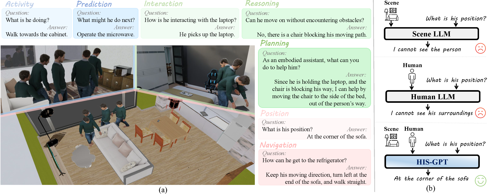

<div align="center">
  <h1> HIS-GPT: Towards 3D Human-In-Scene Multimodal Understanding </h1>
</div>

*HIS-GPT* is a large multi-modal foundation model for **human-in-scene (HIS)** understanding, a new task that we raise for understanding human behaviors in 3D scenes. To evaluate this new task, we also release *HIS-Bench*, the first multi-modal benchmark for comprehensively evaluating model's abilities on human-in-scene understanding. [<a href="https://arxiv.org/abs/2503.12955">Paper</a>]



**TODO**:

- [x] Upload the training & evaluation code.
- [ ] Release the data and annotations of HIS-Bench.
- [ ] Release the training data and pretrained weights of HIS-GPT.
- [ ] Add local demo interface.

## HIS-GPT

### Quick Start
<details>
  <summary><b>Environmental Setup</b></summary>
  
```
conda create -n hisgpt python=3.10
pip install torch==2.2.1 torchvision==0.17.1 torchaudio==2.2.1 --index-url https://download.pytorch.org/whl/cu118
pip install -r requirements.txt
```
</details>
<details>
  <summary><b>Data Preparation</b></summary>
  TBD
</details>

### Training
*Step 1*: Multi-modal pre-training:
```
bash scripts/human_scene_pt.sh
```

*Step 2*: Human-in-scene instruction tuning:
```
bash scripts/human_scene_it.sh
```

### Evaluation
To evaluate the model on HIS-Bench, please first download and prepare the HIS-Bench data according to the following steps:

Then, run the inference to get the model's answers on HIS-Bench questions:

Finally, use the gpt-based evaluation code to get the performance score:

### Citation
If you find our paper useful, please consider citing:
```{bibtex}
@misc{zhao2025hisgpt3dhumaninscenemultimodal,
      title={HIS-GPT: Towards 3D Human-In-Scene Multimodal Understanding}, 
      author={Jiahe Zhao and Ruibing Hou and Zejie Tian and Hong Chang and Shiguang Shan},
      year={2025},
      eprint={2503.12955},
      archivePrefix={arXiv},
      primaryClass={cs.CV},
      url={https://arxiv.org/abs/2503.12955}, 
}
```

### Acknowledgements
This code implementation is based on [Chat-Scene](https://github.com/ZzZZCHS/Chat-Scene). Thanks to their awesome work!