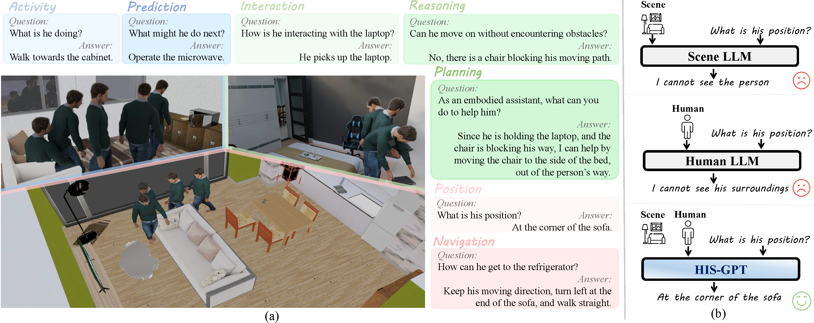

<div align="center">
  <h1> [ICCV25] HIS-GPT: Towards 3D Human-In-Scene Multimodal Understanding </h1>
</div>

*HIS-GPT* is a large multi-modal foundation model for **human-in-scene (HIS)** understanding, a new task that we raise for understanding human behaviors in 3D scenes. To evaluate this new task, we also release *HIS-Bench*, the first multi-modal benchmark for comprehensively evaluating model's abilities on human-in-scene understanding. [<a href="https://arxiv.org/abs/2503.12955">Paper</a>]



**TODO**:

- [x] Upload the training & evaluation code.
- [x] Release the annotations of HIS-Bench and HIS-GPT training data.
- [ ] Release the pretrained weights of HIS-GPT.

## HIS-Bench

HIS-Bench data could be downloaded from <a href="https://uob-my.sharepoint.com/:f:/g/personal/ur25890_bristol_ac_uk/EmXxAIpeuyxIkGAfP225grsBUz4-6PATVA8iEoqHAXM1VA?e=klATTj">this link</a>.

  - The dataset contains the following components:
    - `qas_val`: all the question-answering samples of HIS-Bench, divided into separate `.json` files for each sub-task. A data example looks like:
      ```
      {
         "task": "activity",
         "index": 0,
         "data_id": "PROX#BasementSittingBooth_00142_01#40.0_50.0",
         "scene_id": "BasementSittingBooth",
         "motion_id": "PROX#BasementSittingBooth_00142_01#40.0_50.0",
         "qa": [{"question": "What is the person doing initially?", "answer": "He sits at a table."]
      }
      ```
    - `pcd_all`: the 3D point cloud data for every 3D scene in HIS-Bench, named as `<scene_id>.pth`.
    - `motion_tokens`: the token ids for each 3D motion in HIS-Bench, extracted by M3GPT. Named as `<motion_id>.npy`.
    - `motion_trajs`: the 2D trajectories for each 3D motion in HIS-Bench. Named as `<data_id>.npy'.
    - `hisbench_mask3d_uni3d_feats.pt`: the 3D scene representations of HIS-Bench, extracted by Uni3D and can be directly used for HIS-GPT inference.

### Evaluation
See <a href="https://github.com/ZJHTerry18/HumanInScene/blob/main/evaluation/README.md">EVALUATION.md</a>.

## HIS-GPT

### Quick Start
<details>
  <summary><b>Environmental Setup</b></summary>
  
```
conda create -n hisgpt python=3.10
pip install torch==2.2.1 torchvision==0.17.1 torchaudio==2.2.1 --index-url https://download.pytorch.org/whl/cu118
pip install -r requirements.txt
```
</details>
<details>
  <summary><b>Data Preparation</b></summary>
  
  Download the HIS-GPT training data from <a href="https://uob-my.sharepoint.com/:f:/g/personal/ur25890_bristol_ac_uk/En2epSoEPBRLpy7qCL2PxfIBrocUlIzniZdMarmjjBekAA?e=qYil1E">here</a>.
  
  Put all the data under the `./annotations` directory. Unzip the `.zip` files in the subdirectories. You will get the directory contains the following contents:
```
annotations
├── scannet_mask3d_uni3d_feats.pt      # 3D scene representations for ScanNet scenes (used by HUMANISE and SceneVerse)
├── scannet_mask3d_train_attributes.pt # 3D scene attributes for ScanNet scenes (used by HUMANISE and SceneVerse)
├── trumans_mask3d_uni3d_feats.pt      # 3D scene representations for TRUMANS scenes
├── trumans_mask3d_train_attributes.pt # 3D scene attributes for TRUMANS scenes
├── m3gpt_t2m_motion_embeds.pt         # embedding vectors for human motions
├── humanise/trumans                   # annotations for human-in-scene data
    ├── qas_pt_v1    # HUMANISE captions for pre-training
    ├── qas_train_v1 # HUMANISE QA data for instruction tuning
    ├── motion_tokens # tokens for 3D human motions
    └── motion_trajs  # trajectory for 3D human motions
├── sceneverse                         # annotations for SceneVerse (scene-only) data
└── motionx                            # annotations for HumanML3D (motion-only) data
```
For 3D scene and 3D human motion data, we pre-extracted them into latent embeddings using the relevant encoders (to save storage). That is, the features and attributes in our provided annotations are directly fed into the projection layers and the large language model when you run the training codes.

Note: If you want to extract 3D scene features (`..._uni3d_feats.pt` and `..._train_attributes.pt`) from the raw data, you could refer to <a href="https://github.com/ZzZZCHS/Chat-Scene/tree/dev/preprocess">this guidance</a>.
</details>

<details>
  <summary><b>Model Preparation</b></summary>
  
  Download <a href="https://huggingface.co/lmsys/vicuna-7b-v1.5">vicuna-7b-v1.5</a>, which is the model we will use as the pre-trained LLM.

</details>

### Training
- Configurations before training
  - Set the `llama_model_path` in `scripts/human_scene_pt.sh` and `scripts/human_scene_it.sh` to your own vicuna-7b-v1.5 path.
  - Set `output_dir` to your own output directory.

*Step 1*: Multi-modal pre-training:
```
bash scripts/human_scene_pt.sh
```

*Step 2*: Human-in-scene instruction tuning:
```
bash scripts/human_scene_it.sh
```

## Citation
If you find our paper useful, please consider citing:
```{bibtex}
@misc{zhao2025hisgpt3dhumaninscenemultimodal,
      title={HIS-GPT: Towards 3D Human-In-Scene Multimodal Understanding}, 
      author={Jiahe Zhao and Ruibing Hou and Zejie Tian and Hong Chang and Shiguang Shan},
      year={2025},
      eprint={2503.12955},
      archivePrefix={arXiv},
      primaryClass={cs.CV},
      url={https://arxiv.org/abs/2503.12955}, 
}
```

## Acknowledgements
This code implementation is based on [Chat-Scene](https://github.com/ZzZZCHS/Chat-Scene). Thanks to their awesome work!
